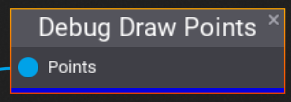
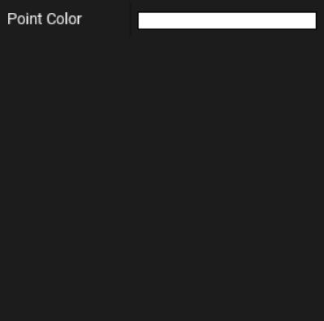

# Debug Draw Points

The **Debug Draw Points** node takes a list of points and draws them in the editor viewport. This does not work in a built game.

## Properties
| Property | Description |
|--------|--------|
| **Point Color** | The color of the points to be drawn. |

## Example
### Graph:
The following graph finds all box colliders inside the volume, samples points on them, and then draws debug points at those points.

### Output:

