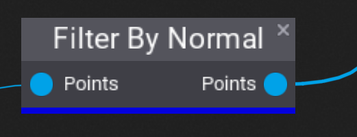
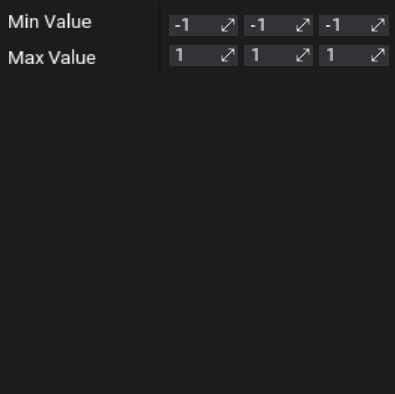

# Filter By Normal

The **Filter By Normal** node takes a list of points and creates a new list of points where the "Normal" property is between the specified minimum and maximum values. Each component of the normal vector is checked separately. This node is useful to limit the slope that a point can be at, since, for example, trees don't often grow at 90 degree angles.

## Properties

| Property | Description |
|--------|--------|
| **Min Value** | The lowest value of the "Normal" property for this point to be included in the output. |
| **Max Value** | The highest value of the "Normal" property for this point to be included in the output. |