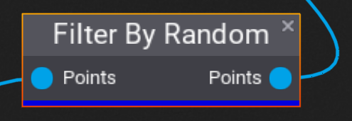
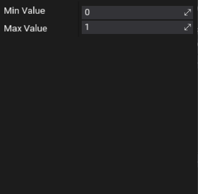

# Filter By Random

The **Filter By Random** node takes a list of points and creates a new list of points where the "Random" property is between the specified minimum and maximum values.

## Properties
| Property | Description |
|--------|--------|
| **Min Value** | The lowest value of the "Random" property for this point to be included in the output. |
| **Max Value** | The highest value of the "Random" property for this point to be included in the output. |

