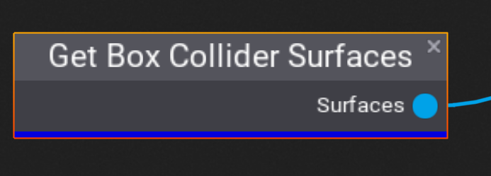

# Get Box Collider Surfaces

The **Get Box Collider Surfaces** node searches for all BoxCollider actors contained within the PLCT Volume and outputs the list of surfaces. These surfaces can later be sampled into points using a [Sample Surface](sample-surface.md) node.

## Properties
This node has no properties.