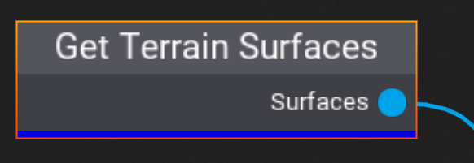

# Get Terrain Surfaces

The **Get Terrain Surfaces** node searches for all terrain actors contained within the PLCT Volume and outputs the list of surfaces. These surfaces can later be sampled into points using a [Sample Surface](sample-surface.md) node.

## Properties
This node has no properties.