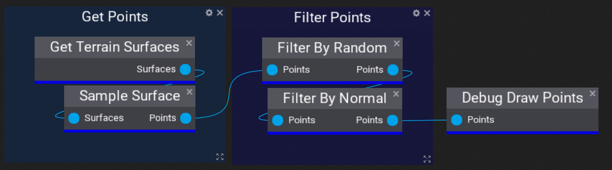

# PLCT Graph

The **PLCT Graph System** allows you to quickly put together nodes to interact with PLCT and get a level generator built. This section documents each node, what it does, and how you might use it.

## In this section

* [Spawn Prefab At Points](spawn-prefab-at-points.md)
* [Filter By Random](filter-by-random.md)
* [Filter By Normal](filter-by-normal.md)
* [Set Points Transform](set-points-transform.md)
* [Transform Points](transform-points.md)
* [Debug Draw Points](debug-draw-points.md)
* [Sample Surface](sample-surface.md)
* [Get Terrain Surfaces](get-terrain-surfaces.md)
* [Get Box Collider Surfaces](get-box-collider-surfaces.md)