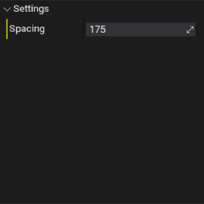

# Sample Surface

The **Sample Surface** node takes a collection of surfaces and samples them along a grid within the PLCT Volume. The spacing of the points on the grid can be configured by the node's properties. Each point is given a property "Random" which is a random number between 0 and 1, which can be used to filter points using the [Filter By Random](filter-by-random.md) node. Each point is also given a property "Normal", which can be used to filter points based on their slope using the [Filter By Normal](filter-by-normal.md) node.

## Properties

| Property | Description |
|--------|--------|
| **Spacing** | The distance (in cm) between each point that gets sampled on the grid. |