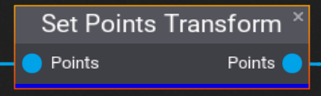
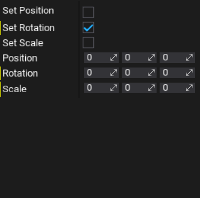

# Set Points Transform

The **Set Points Transform** node takes a list of points and sets their transforms to the specified values. The setting of each component (**Position**, **Rotation**, and **Scale**) can be toggled.

## Properties
| Property | Description |
|--------|--------|
| **Set Position** | Whether or not to set the Position of the point. |
| **Set Position** | Whether or not to set the Rotation of the point. |
| **Set Position** | Whether or not to set the Scale of the point. |
| **Position** | The position to set the point to if **Set Position** is true. |
| **Rotation** | The rotation to set the point to if **Set Rotation** is true. |
| **Scale** | The scale to set the point to if **Set Scale** is true. |

