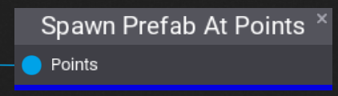
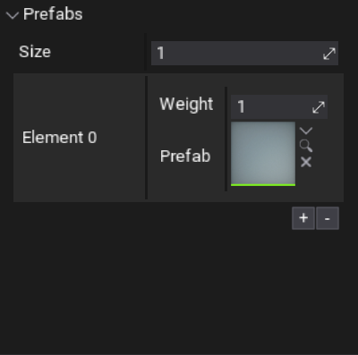

# Spawn Prefab At Points

The **Spawn Prefab at Points** node takes a list of points and, for each point, spawns a random prefab from a list at that point. Each prefab entry in the list has a **Weight** property which controls how likely the prefab is to be spawned.

## Properties
| Property | Description |
|--------|--------|
| Prefabs | The list of prefabs that could be spawned. |

### Prefab Entry Properties
| Property | Description |
|--------|--------|
| **Weight** | The weight of the specific prefab entry. |
| **Prefab** | The prefab to spawn if this 
entry is picked. |

