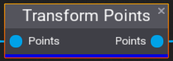
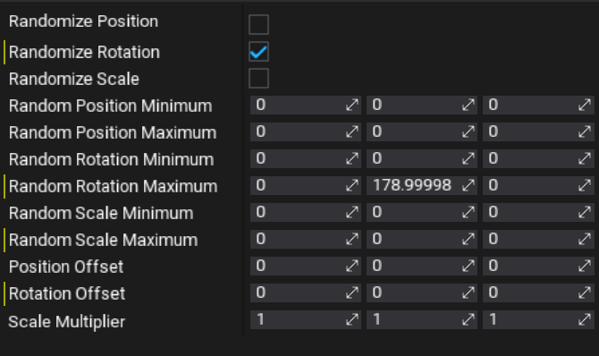

# Transform Points

The **Transform Points** node takes a list of points and offsets the components of their transforms. First, the transforms are adjusted by the static offsets, **Position Offset**, **Rotation Offset**, and **Scale Offset**. Then, for each component, if the associated randomization checkbox is enabled, a second offset is calculated by picking a random value between the corresponding minimum and maximum for the component.

## Properties

| Property | Description |
|--------|--------|
| **Randomize Position** |  Whether or not to add a randomized **Position** offset. |
| **Randomize Rotation** |  Whether or not to add a randomized **Rotation** offset. |
| **Randomize Scale** |  Whether or not to add a randomized **Scale** multiplier. |
| **Random Position Minimum** |  The minimum value for the randomized **Position**. |
| **Random Position Maximum** |  The maximum value for the randomized **Position**. |
| **Random Rotation Minimum** |  The minimum value for the randomized **Rotation**. |
| **Random Rotation Maximum** |  The maximum value for the randomized **Rotation**. |
| **Random Scale Minimum** |  The minimum value for the randomized **Scale**. |
| **Random Scale Maximum** |  The maximum value for the randomized **Scale**. |
| **Position Offset** | The static offset for the **Position**. |
| **Rotation Offset** | The static offset for the **Rotation**. |
| **Scale Multipler** | The static multiplier for the **Scale**. |