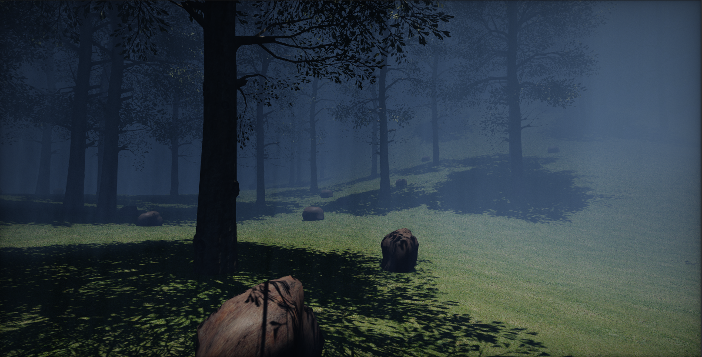

# Procedural Level Creation Tools

Procedural Level Creation Tools (**PLCT**) is a set of tools that allow you to quickly generate large levels for players to interact with. These tools include landscape samplers, point filters, prefab spawners, and more. Using PLCT, generating an environment or building a level can become as simple as pressing a button.

This section explains how PLCT is structured, how you can use it in different scenarios, and how you can use the graph system to design a level generator.

## In This Section

* [PLCT Graph](graph/index.md)
  * [Spawn Prefab At Points](graph/spawn-prefab-at-points.md)
  * [Filter By Random](graph/filter-by-random.md)
  * [Filter By Normal](graph/filter-by-normal.md)
  * [Set Points Transform](graph/set-points-transform.md)
  * [Transform Points](graph/transform-points.md)
  * [Debug Draw Points](graph/debug-draw-points.md)
  * [Sample Surface](graph/sample-surface.md)
  * [Get Terrain Surfaces](graph/get-terrain-surfaces.md)
  * [Get Box Collider Surfaces](graph/get-box-collider-surfaces.md)